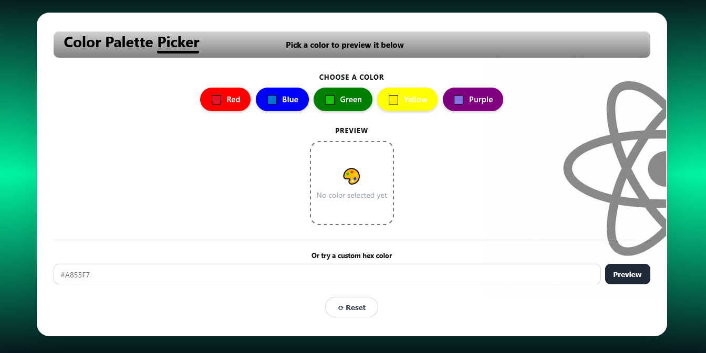

# 🎨 Color Palette Picker

A mini React application that allows users to select colors from a palette or enter a custom hex code and preview the selected color instantly.

This project was built as a React practice project to strengthen core concepts including JSX, functional components, props, state management, event handling, `.map()`, and conditional rendering.


---

## 🚀 Live Demo

🔗 **Vercel:** [(https://color-palette-rosy-two.vercel.app/)]

---

## ✨ Features

- 🎨 Select colors from predefined options:
  - Red
  - Blue
  - Green
  - Yellow
  - Purple
- ✅ Selected color button displays a visual indicator
- 🖼 Live preview area updates instantly with the chosen color
- 💬 Displays **"No color selected yet"** when no color is selected
- 🔄 Reset button clears the current selection
- 🎯 Supports custom hex color input (example: `#A855F7`)
- ✨ Smooth animations and hover effects
- 🧩 Colors are rendered dynamically using JavaScript `.map()`

---

## 🖼 Preview

| Empty State              | Selected Color                   |
| ------------------------ | -------------------------------- |
| 🎨 No color selected yet | Animated color preview with name |

()

---

## 🧩 Component Structure

```
App.jsx
├── Card.jsx
│   └── Layout wrapper using props.children
│
├── ColorButton.jsx
│   └── Displays clickable color buttons
│
└── ColorPreview.jsx
    └── Displays selected color preview
```

### Component Responsibilities

| Component          | Responsibility                       | Props                            |
| ------------------ | ------------------------------------ | -------------------------------- |
| `App.jsx`          | Manages state and renders components | —                                |
| `ColorButton.jsx`  | Displays individual color buttons    | `color`, `onClick`, `isSelected` |
| `ColorPreview.jsx` | Displays active color preview        | `color`                          |
| `Card.jsx`         | Reusable container component         | `children`                       |

---

## 📁 Project Structure

```
color-palette-picker/
│
├── index.html
├── package.json
├── vite.config.js
│
└── src/
    ├── main.jsx
    ├── index.css
    ├── App.jsx
    │
    └── components/
        ├── ColorButton.jsx
        ├── ColorPreview.jsx
        └── Card.jsx
```

---

## ⚙️ Installation and Setup

### Requirements

- Node.js 18+

### Clone Repository

```bash
git clone https://github.com/yourusername/color-palette-picker.git
```

### Navigate to Project Folder

```bash
cd color-palette-picker
```

### Install Dependencies

```bash
npm install
```

### Run Development Server

```bash
npm run dev
```

Open the URL shown in your terminal:

```
http://localhost:5173
```

---

## 🏗 Build for Production

Create a production build:

```bash
npm run build
```

Preview the production build:

```bash
npm run preview
```

---

## 🛠 Built With

- **React 18** — UI components and state management
- **Vite** — Development environment and build tool
- **JavaScript ES6+** — Application logic
- **Plain CSS** — Custom styling

---

## 📚 React Concepts Practiced

- ✅ JSX syntax
- ✅ Functional components
- ✅ Component reusability
- ✅ `useState` hook
- ✅ Props and one-way data flow
- ✅ Event handling (`onClick`, `onChange`, `onSubmit`)
- ✅ Rendering lists using `.map()`
- ✅ Conditional rendering
- ✅ `props.children` composition

---

## 🔮 Future Improvements

- Save favorite colors using `localStorage`
- Create and save custom palettes
- Add color picker input
- Copy hex codes to clipboard
- Add dark/light theme support
- Add user authentication

---

## 👨‍💻 Author

**Seid Jemal**

GitHub:github.com/Seid-Star

---

⭐ If you find this project useful, consider giving it a star!

---

Made as a React learning project while practicing JSX, Components, Props, State, Events, `.map()`, and Conditional Rendering.
