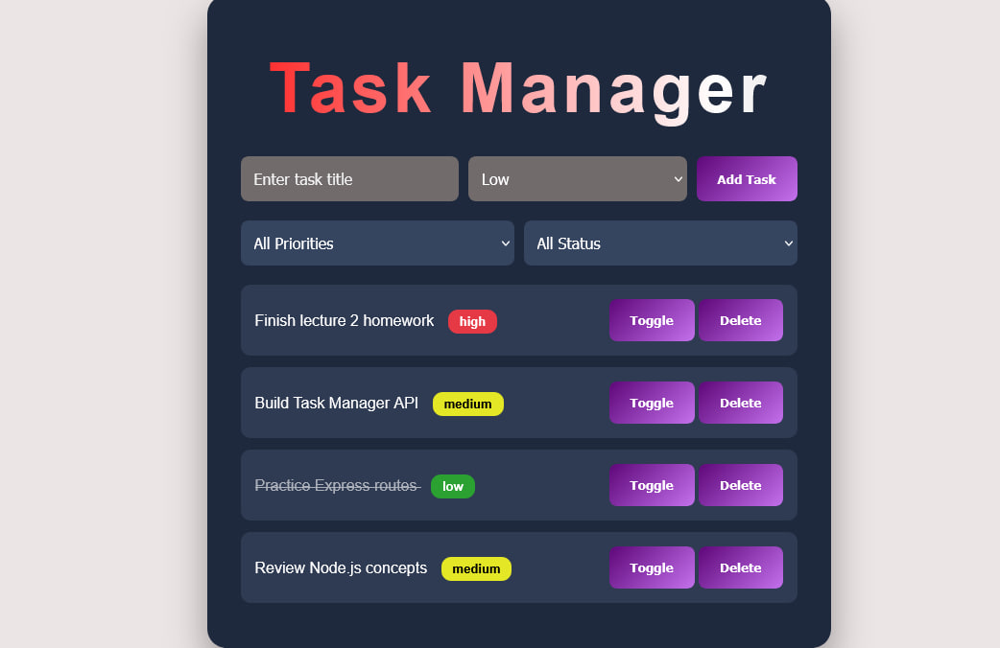

# Task Manager App

A full-stack Task Manager application built with **Node.js**, **Express**, and vanilla
**HTML/CSS/JavaScript**, following the MVC pattern (routes → controllers → services → data).
Users can create, view, update, filter, complete, and delete tasks through a clean web interface.

---

## 🌐 Live Demo

**Frontend:**
`https://taskmanagerapi-chi.vercel.app/`

**Backend API:**
`https://task-manager-api-7wm6.onrender.com`

---

## 📸 Screenshot

## 

## 📁 Folder Structure

```
task-manager-api/
│
├── backend/
│   ├── config/
│   │   └── env.js
│   ├── data/
│   │   └── taskData.js
│   ├── services/
│   │   └── taskService.js
│   ├── controllers/
│   │   └── taskController.js
│   ├── routes/
│   │   └── taskRoutes.js
│   ├── .env
│   ├── .env.example
│   ├── index.js
│   └── package.json
│
├── frontend/
│   ├── index.html
│   ├── style.css
│   └── app.js
│
├── screenshots/
└── README.md
```

---

## 🚀 How to Run Locally

### Backend

```bash
cd backend
npm install
npm run dev
```

Backend runs on:

```
http://localhost:5000
```

Create a `.env` file in `backend/` (or copy `.env.example`):

```
PORT=5000
APP_NAME=Task Manager API
```

### Frontend

Open `frontend/index.html` directly in your browser, or run it with the VS Code
**Live Server** extension for auto-reload.

---

## 🔗 API Endpoints

| Method | Route                   | Description                           |
| ------ | ----------------------- | ------------------------------------- |
| GET    | `/api/tasks`            | Get all tasks (supports filters)      |
| GET    | `/api/tasks/:id`        | Get a single task by ID               |
| POST   | `/api/tasks`            | Create a new task                     |
| PATCH  | `/api/tasks/:id`        | Update a task (title/priority/status) |
| PATCH  | `/api/tasks/:id/toggle` | Toggle a task's completed status      |
| DELETE | `/api/tasks/:id`        | Delete a task                         |

### Query Parameters (Filtering)

```
GET /api/tasks?priority=high
GET /api/tasks?completed=true
GET /api/tasks?priority=low&completed=false
```

---

## 📌 Example cURL Requests

**Get all tasks**

```bash
curl https://task-manager-api-7wm6.onrender.com/api/tasks
```

**Create a task**

```bash
curl -X POST https://task-manager-api-7wm6.onrender.com/api/tasks \
  -H "Content-Type: application/json" \
  -d '{"title":"Learn Deployment","priority":"medium"}'
```

**Toggle completed**

```bash
curl -X PATCH https://task-manager-api-7wm6.onrender.com/api/tasks/1/toggle
```

**Delete a task**

```bash
curl -X DELETE https://task-manager-api-7wm6.onrender.com/api/tasks/1
```

---

## ⚠️ Error Handling

| Status Code | Meaning                                       |
| ----------- | --------------------------------------------- |
| `200`       | Request succeeded                             |
| `201`       | Task created successfully                     |
| `400`       | Invalid request body (missing/invalid fields) |
| `404`       | Task or route not found                       |
| `500`       | Unexpected server error                       |

---

## 🌐 Deployment

### Backend

Deployed using: **Render**
URL: `https://task-manager-api-7wm6.onrender.com`

Set the following environment variables in the Render dashboard:

```
PORT=5000
APP_NAME=Task Manager API
```

### Frontend

Deployed using: **Vercel**
URL: `https://taskmanagerapi-chi.vercel.app/`

---

## ✅ Bonus Features Implemented

- ✔️ Toggle task completed status
- ✔️ Filtering tasks by priority and completion status
- ✔️ Delete tasks directly from the UI
- ✔️ Deployed live (backend + frontend)

---

## 🛠 Technologies Used

**Frontend**

- HTML5
- CSS3
- JavaScript (Fetch API)

**Backend**

- Node.js
- Express.js
- CORS
- dotenv

**Deployment**

- Render (backend)
- Vercel (frontend)

---

## 👤 Author

Seid Jemal
[GitHub](https://github.com/Seid-Star) ·
